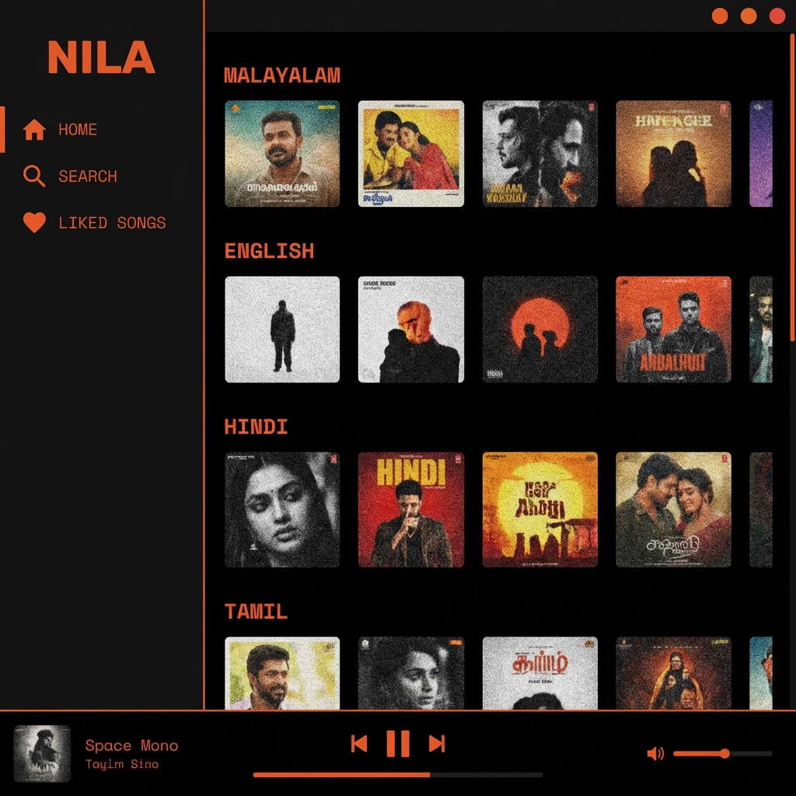

<p align="center">
  
</p>

<h1 align="center">🎵 Nila — Linux Music Player</h1>

<p align="center">
  <strong>A sleek, retro-inspired desktop music player for Linux — stream music directly from YouTube.</strong>
</p>

<p align="center">
  <a href="#features">Features</a> •
  <a href="#screenshots">Screenshots</a> •
  <a href="#installation">Installation</a> •
  <a href="#usage">Usage</a> •
  <a href="#tech-stack">Tech Stack</a> •
  <a href="#architecture">Architecture</a> •
  <a href="#contributing">Contributing</a> •
  <a href="#license">License</a>
</p>

---

## ✨ Overview

**Nila** is a lightweight, Spotify-inspired desktop music player built with Electron for Linux. It streams music directly from YouTube using `yt-dlp` and `mpv`, wrapped in a beautiful dark-themed UI with retro orange accents.

No accounts. No ads. No subscriptions. Just music.

---

## 🎯 Features

- 🔍 **YouTube Search** — Search and stream any song from YouTube instantly
- 🎶 **Multi-Genre Categories** — Browse curated categories: Malayalam, English, Hindi, Tamil, Telugu, Punjabi, Pop, K-Pop, Chill, Romantic, Marathi
- ❤️ **Liked Songs** — Save your favorite tracks locally for quick access
- 🎛️ **Floating Player** — A compact, always-on-top mini player with vinyl disc animation
- ▶️ **Queue System** — Automatic queue management with next/previous track support
- 🎨 **Retro Dark Theme** — Pure black background with `#eb5e28` orange accents and Space Mono typography
- ⏯️ **Full Playback Controls** — Play, pause, next, previous, and progress tracking
- 💾 **Persistent Favorites** — Your liked songs are saved across sessions

---

## 📸 Screenshots

### Main Window
<p align="center">
  
</p>

---

## 🚀 Installation

### Prerequisites

Make sure you have the following installed on your Linux system:

| Tool | Purpose | Install Command (Debian/Ubuntu) |
|---|---|---|
| **Node.js** (v18+) | Runtime | `sudo apt install nodejs npm` |
| **yt-dlp** | YouTube audio extraction | `sudo apt install yt-dlp` or `pip install yt-dlp` |
| **mpv** | Audio playback | `sudo apt install mpv` |

### Setup

```bash
# 1. Clone the repository
git clone https://github.com/Adarshh-bit/Nila-linux-music-player.git

# 2. Navigate to the project
cd Nila-linux-music-player

# 3. Install dependencies
npm install

# 4. Launch the app
npm start
```

---

## 🎮 Usage

### Home Screen
Browse through curated music categories. Click any song card to start streaming.

### Search
Navigate to the **Search** tab, type your query, and press **Enter**. Results appear as interactive cards.

### Liked Songs
Click the ❤️ heart icon on the player bar to like/unlike a song. View all your liked songs in the **Liked Songs** tab.

### Floating Player
When a song starts playing, a compact floating player window opens with:
- Spinning vinyl disc animation
- Song info & progress bar
- Play/Pause, Next, Previous controls
- Always-on-top for multitasking

### Queue System
- Clicking a song in a category creates a queue from that category
- Use **Next/Previous** buttons to navigate through the queue
- Songs auto-advance when finished

---

## 🛠️ Tech Stack

| Technology | Role |
|---|---|
| **Electron** | Desktop app framework |
| **HTML/CSS/JS** | Frontend UI |
| **yt-dlp** | YouTube metadata & stream URL extraction |
| **mpv** | Audio playback engine |
| **Node.js** | Backend process management |

---

## 🏗️ Architecture

```
Nila-linux-music-player/
├── main.js              # Electron main process — window management, playback engine, IPC
├── index.html           # Main application window layout
├── index.js             # Renderer process — UI logic, queue system, search, favorites
├── playing.html         # Floating mini-player window (self-contained HTML + CSS + JS)
├── styles.css           # Global styles — dark theme, layout, components
├── package.json         # Project metadata & dependencies
└── .gitignore           # Git ignore rules
```

### How It Works

```
┌─────────────┐     IPC      ┌──────────────┐
│  index.html │◄────────────►│   main.js    │
│  index.js   │  (Electron)  │  (Main Proc) │
│  (Renderer) │              │              │
└─────────────┘              │  ┌─────────┐ │
                             │  │ yt-dlp  │ │  → Fetches stream URLs
┌─────────────┐     IPC      │  └─────────┘ │
│playing.html │◄────────────►│  ┌─────────┐ │
│(Float Player)│             │  │  mpv    │ │  → Plays audio
└─────────────┘              │  └─────────┘ │
                             └──────────────┘
```

1. **User** selects a song in the renderer (index.js)
2. **Main process** (main.js) receives the request via IPC
3. **yt-dlp** extracts the best audio stream URL from YouTube
4. **mpv** spawns as a child process to play the stream
5. **Play state** is broadcast to both the main window and floating player

---

## 🤝 Contributing

Contributions are welcome! Here's how you can help:

1. **Fork** the repository
2. **Create** a feature branch: `git checkout -b feature/amazing-feature`
3. **Commit** your changes: `git commit -m 'Add amazing feature'`
4. **Push** to the branch: `git push origin feature/amazing-feature`
5. **Open** a Pull Request

### Ideas for Contribution
- 🔊 Volume control slider
- 📋 Playlist management
- 🎵 Lyrics display
- 🌙 Light/dark mode toggle
- 📱 Responsive layout improvements
- 🔀 Shuffle & repeat modes

---

## 📄 License

This project is licensed under the **ISC License** — see the [LICENSE](LICENSE) file for details.

---

<p align="center">
  Built with ❤️ and 🎵 by <a href="https://github.com/Adarshh-bit">Adarsh</a>
</p>
